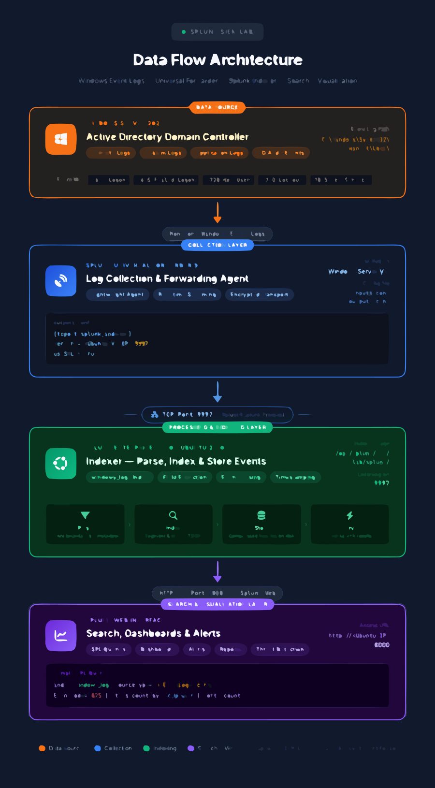
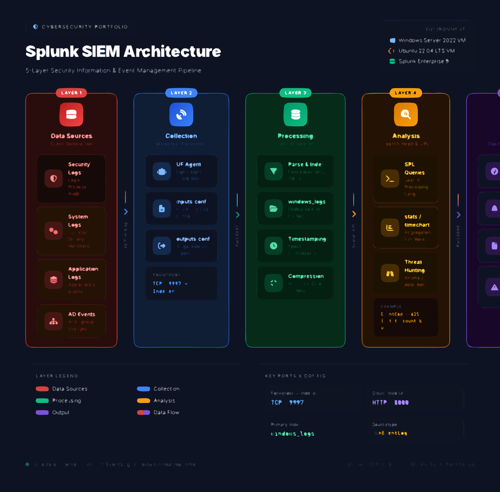

# 🔍 Splunk SIEM & Log Analysis Lab


> **A hands-on SIEM lab demonstrating log ingestion, SPL search queries, security dashboard creation, and automated alerting — core SOC Analyst competencies built on Splunk Free and Azure infrastructure.**

---

## 📋 Table of Contents

- [Certification Alignment](#-certification-alignment)
- [Business Problem](#-business-problem)
- [Career Relevance](#-career-relevance)
- [Key Concepts](#-key-concepts)
- [Architecture](#-architecture)
- [What You Will Learn](#-what-you-will-learn)
- [Lab Setup — Step by Step](#-lab-setup--step-by-step)
  - [Step 1: Get Splunk Free](#step-1-get-splunk-free)
  - [Step 2: Configure Data Inputs](#step-2-configure-data-inputs)
  - [Step 3: Essential SPL Searches](#step-3-essential-spl-searches)
  - [Step 4: Build a Security Dashboard](#step-4-build-a-security-dashboard)
  - [Step 5: Create an Automated Alert](#step-5-create-an-automated-alert)
- [Verification Checklist](#-verification-checklist)
- [Portfolio Recommendations](#-portfolio-recommendations)
- [Resume Bullet Points](#-resume-bullet-points)

---

## 🎓 Certification Alignment

| Certification | Relevant Domains |
|:---|:---|
| **CompTIA Security+** | Domain 4.0 — Security Operations |
| **CompTIA CySA+** | Domain 4.0 — Security Operations & Monitoring |
| **Splunk Core Certified User** | Data searching, reporting, dashboards, alerts |
| **Google Cybersecurity Certificate** | SIEM tools, log analysis, incident detection |
| **SC-200 (Microsoft)** | Threat hunting & investigation using SIEM platforms |

---

## 💼 Business Problem

### Why Do Organizations Need a SIEM?

Every enterprise generates an enormous volume of logs — from firewalls, endpoints, servers, cloud workloads, and applications. Without a centralized system to collect, normalize, and correlate these logs, security teams face critical blind spots:

- **Dwell time increases** — Adversaries remain undetected for weeks or months because alerts aren't correlated across sources.
- **Compliance gaps appear** — Regulations like PCI-DSS, HIPAA, and SOX mandate centralized log retention and regular review.
- **Incident response slows** — Analysts waste hours jumping between isolated log files instead of querying a single pane of glass.

A **Security Information and Event Management (SIEM)** platform like Splunk solves these problems by providing real-time visibility, automated alerting, and forensic search capability across the entire environment.

> ✅ **This lab simulates exactly what a SOC Analyst does on Day 1:** configure log ingestion, write detection queries, build dashboards, and create alerts that fire when suspicious activity occurs.

---

## 🎯 Career Relevance

| Role | How This Lab Applies |
|:---|:---|
| **SOC Analyst (Tier 1)** | Monitor dashboards, triage alerts, investigate Windows Event IDs |
| **SOC Analyst (Tier 2)** | Write custom SPL queries, build correlation searches, tune alert thresholds |
| **Detection Engineer** | Create detection rules, map queries to MITRE ATT&CK, reduce false positives |
| **Security Engineer** | Deploy and configure forwarders, manage data inputs, architect log pipelines |
| **Incident Responder** | Conduct forensic searches across historical log data during active incidents |
| **GRC / Compliance Analyst** | Demonstrate centralized logging and monitoring controls to auditors |

---

## 🧠 Key Concepts

### SIEM (Security Information and Event Management)

A SIEM platform collects logs from across your environment, normalizes the data into a common schema, and enables security analysts to **search**, **correlate**, and **alert** on suspicious activity in real time.

| Capability | Description |
|:---|:---|
| **Log Aggregation** | Centralized collection from endpoints, network devices, cloud, and applications |
| **Normalization** | Standardizes disparate log formats into searchable fields |
| **Correlation** | Links related events across sources (e.g., failed login → successful login → data exfiltration) |
| **Alerting** | Fires automated notifications when predefined conditions are met |
| **Forensics** | Enables retrospective investigation across retained log history |

### SPL (Search Processing Language)

Splunk's query language for searching, filtering, transforming, and visualizing log data. SPL operates as a **pipeline** — each command passes its results to the next using the pipe `|` operator.

```spl
index=main sourcetype=WinEventLog:Security EventCode=4625
| stats count by src_ip
| sort -count
| head 10
```

**Pipeline breakdown:**
1. **Search** — Pull failed login events from the Security log
2. **Stats** — Count occurrences grouped by source IP
3. **Sort** — Order results by count, descending
4. **Head** — Return only the top 10

### Indexes

Indexes are Splunk's data stores — logical containers that hold ingested log data. Think of them as separate databases optimized for fast search.

| Index | Purpose |
|:---|:---|
| `main` | Default index for general data |
| `wineventlog` | Windows Event Logs (Security, System, Application) |
| `_internal` | Splunk's own operational logs |
| Custom indexes | Created for specific use cases (e.g., `firewall`, `webapp`) |

### Universal Forwarder

A lightweight Splunk agent installed on endpoints that **collects and forwards log data** to the Splunk indexer. It consumes minimal resources and does not index data locally.

<p align="center">
  
</p>

```

### Critical Windows Event IDs

These are the Event IDs every SOC Analyst must know. They appear in the Windows Security Event Log and are the foundation of most detection rules.

| Event ID | Description | Why It Matters |
|:---:|:---|:---|
| **4624** | Successful logon | Establishes baseline access patterns |
| **4625** | Failed logon | Brute force detection, credential stuffing |
| **4672** | Special privileges assigned | Privilege escalation monitoring |
| **4688** | New process created | Malware execution, LOLBins detection |
| **4720** | User account created | Persistence, unauthorized account creation |
| **4732** | Member added to security group | Privilege escalation via group membership |
| **7045** | Service installed | Persistence mechanism, malware installation |

### inputs.conf

The configuration file that tells a Universal Forwarder **what data to collect and where to send it**. Located at:

```
C:\Program Files\SplunkUniversalForwarder\etc\system\local\inputs.conf
```

---

## 🏗️ Architecture

### Data Flow Overview



### Architecture Breakdown



The lab architecture consists of three layers:

| Layer | Component | Role |
|:---|:---|:---|
| **Source** | Windows Server 2022 (Azure VM) | Generates Windows Event Logs (Security, System, Application) |
| **Collection** | Splunk Universal Forwarder | Lightweight agent that reads logs and forwards via TCP 9997 |
| **Analysis** | Splunk Free (Indexer + Search Head) | Receives, indexes, and provides search/dashboard/alerting |

**Data Flow:**
1. Windows generates security events (logons, process creation, service installs)
2. Universal Forwarder reads events defined in `inputs.conf`
3. Forwarder transmits data to the Splunk indexer over **TCP port 9997**
4. Splunk indexes the data, making it searchable via SPL
5. Analysts query, visualize, and create alerts through the Splunk Web UI

> ✅ **This mirrors a production SOC environment** — the only difference is scale. Enterprise deployments use the same forwarder → indexer → search head pattern, often with multiple indexers in a cluster.

---

## 📚 What You Will Learn

| # | Skill | SOC Relevance |
|:---:|:---|:---|
| 1 | Install and configure Splunk Free | Understand SIEM deployment fundamentals |
| 2 | Deploy and configure Universal Forwarder | Endpoint log collection architecture |
| 3 | Write `inputs.conf` for targeted log collection | Precise data onboarding |
| 4 | Search with SPL (stats, sort, table, timechart) | Day-to-day SOC investigation |
| 5 | Build a multi-panel security dashboard | Real-time situational awareness |
| 6 | Create automated alerts with thresholds | Proactive threat detection |
| 7 | Interpret Windows Security Event IDs | Triage and investigate security events |
| 8 | Correlate events across log sources | Connect the dots during incidents |

---

## 🛠️ Lab Setup — Step by Step

### Step 1: Get Splunk Free

#### 1.1 — Create a Temporary Email (Optional)

If you prefer to keep your primary email separate from lab accounts, use a temporary email service:

1. Navigate to [https://temp-mail.org](https://temp-mail.org)
2. Copy the generated email address
3. Use this address for Splunk account registration

> ✅ **Tip:** Temp email services auto-delete after a short period. Save your Splunk credentials in a password manager immediately after registration.

#### 1.2 — Register for Splunk Free

1. Go to [https://www.splunk.com/en_us/download/splunk-enterprise.html](https://www.splunk.com/en_us/download/splunk-enterprise.html)
2. Click **"Free Splunk"**
3. Create an account using your email
4. Download the **Windows (.msi)** installer for your Azure VM

#### 1.3 — Install Splunk on Your Azure VM

```powershell
# Run the MSI installer on your Windows Server VM
# During installation:
# - Accept the license agreement
# - Set an admin username and password (save these!)
# - Use default installation directory: C:\Program Files\Splunk
# - Splunk will install as a Windows service
```

After installation, access the Splunk Web interface:

```
http://localhost:8000
```

Log in with the admin credentials you created during installation.

<!-- 📸 SCREENSHOT: Capture the Splunk Web login page at localhost:8000 after successful installation. Save as: screenshots/splunk-login.png -->

#### 1.4 — Verify Installation

```powershell
# Check that the Splunk service is running
Get-Service SplunkD

# Expected output:
# Status   Name     DisplayName
# ------   ----     -----------
# Running  SplunkD  SplunkD Service
```

---

### Step 2: Configure Data Inputs

#### 2.1 — Enable Receiving on the Splunk Indexer

The Splunk indexer must listen for incoming data from forwarders.

1. In Splunk Web, navigate to: **Settings → Forwarding and Receiving**
2. Under **Receive Data**, click **Configure receiving**
3. Click **New Receiving Port**
4. Enter port: `9997`
5. Click **Save**

<!-- 📸 SCREENSHOT: Capture the "Receive Data" configuration page showing port 9997 enabled. Save as: screenshots/splunk-receiving-port.png -->

> ✅ **Why port 9997?** This is Splunk's default receiving port. In production, this port must be opened in your firewall rules and Azure NSG (Network Security Group).

#### 2.2 — Install the Universal Forwarder

If your log source is a separate machine (or you want to practice the forwarder architecture on the same VM):

1. Download the Universal Forwarder from: [https://www.splunk.com/en_us/download/universal-forwarder.html](https://www.splunk.com/en_us/download/universal-forwarder.html)
2. Run the installer on the endpoint (source machine)
3. During setup:
   - Set a receiving indexer: `<your-splunk-server-ip>:9997`
   - Create a local admin account for the forwarder

```powershell
# Verify the forwarder service is running
Get-Service SplunkForwarder

# Expected output:
# Status   Name              DisplayName
# ------   ----              -----------
# Running  SplunkForwarder   SplunkForwarder Service
```

#### 2.3 — Configure inputs.conf

Create or edit the `inputs.conf` file to specify which Windows Event Logs to collect:

```powershell
# Navigate to the forwarder's local config directory
cd "C:\Program Files\SplunkUniversalForwarder\etc\system\local"

# Create/edit inputs.conf
notepad inputs.conf
```

Add the following configuration:

```conf
# =============================================================
# inputs.conf — Splunk Universal Forwarder Configuration
# Collects Windows Security, System, and Application Event Logs
# =============================================================

[WinEventLog://Security]
disabled = 0
index = main
evt_resolve_ad_obj = 1
checkpointInterval = 5

[WinEventLog://System]
disabled = 0
index = main
checkpointInterval = 5

[WinEventLog://Application]
disabled = 0
index = main
checkpointInterval = 5
```

**Configuration breakdown:**

| Parameter | Value | Purpose |
|:---|:---|:---|
| `disabled` | `0` | Enables log collection (1 = disabled) |
| `index` | `main` | Target index for ingested data |
| `evt_resolve_ad_obj` | `1` | Resolves Active Directory objects in Security logs |
| `checkpointInterval` | `5` | Frequency (seconds) to save read position |

#### 2.4 — Restart the Forwarder

```powershell
# Restart to apply the new inputs.conf
Restart-Service SplunkForwarder
```

#### 2.5 — Verify Data Ingestion

In Splunk Web, run a quick search to confirm logs are flowing:

```spl
index=main sourcetype=WinEventLog:Security | head 10
```

<!-- 📸 SCREENSHOT: Capture search results showing Windows Security events successfully ingested. Save as: screenshots/splunk-data-ingestion.png -->

> ✅ **If no results appear:** Check that the receiving port (9997) is open, the forwarder service is running, and the `inputs.conf` file is saved in the correct directory. Allow 1–2 minutes for initial data to arrive.

---

### Step 3: Essential SPL Searches

These are the queries every SOC Analyst should have ready. Each query targets a specific detection use case.

#### 3.1 — Failed Login Attempts (Brute Force Detection)

```spl
index=main sourcetype=WinEventLog:Security EventCode=4625
| stats count by src_ip, user
| where count > 5
| sort -count
| table src_ip, user, count
```

**What this detects:** Multiple failed logon attempts from a single IP or targeting a single account — a classic indicator of brute force or credential stuffing attacks.

**SOC action:** Investigate the source IP. If external, consider blocking at the firewall. If internal, check for compromised credentials or misconfigured service accounts.

#### 3.2 — Successful Logins After Failures (Compromise Indicator)

```spl
index=main sourcetype=WinEventLog:Security EventCode=4624
| search user IN [
    search index=main sourcetype=WinEventLog:Security EventCode=4625
    | stats count by user
    | where count > 3
    | fields user
]
| table _time, user, src_ip, LogonType
```

**What this detects:** A successful login for an account that recently experienced multiple failures — a strong indicator that a brute force attack succeeded.

#### 3.3 — New User Account Creation

```spl
index=main sourcetype=WinEventLog:Security EventCode=4720
| table _time, user, TargetUserName, SubjectUserName
| sort -_time
```

**What this detects:** Unauthorized account creation — a common persistence technique where attackers create backdoor accounts.

#### 3.4 — Privilege Escalation Monitoring

```spl
index=main sourcetype=WinEventLog:Security EventCode=4672
| stats count by user
| sort -count
| table user, count
```

**What this detects:** Accounts receiving special (admin) privileges. Unusual entries here may indicate privilege escalation.

#### 3.5 — Service Installation (Persistence Detection)

```spl
index=main sourcetype=WinEventLog:System EventCode=7045
| table _time, ServiceName, ImagePath, ServiceType, StartType
| sort -_time
```

**What this detects:** New services being installed — a known persistence mechanism. Malware often installs itself as a Windows service to survive reboots.

#### 3.6 — Login Activity Over Time (Trend Analysis)

```spl
index=main sourcetype=WinEventLog:Security EventCode=4624 OR EventCode=4625
| eval Status=if(EventCode=4624, "Success", "Failure")
| timechart span=1h count by Status
```

**What this detects:** Unusual spikes in login activity. A sudden surge in failures at 3:00 AM likely indicates automated attack tooling.

<!-- 📸 SCREENSHOT: Capture the timechart visualization showing login trends (success vs. failure over time). Save as: screenshots/splunk-login-timechart.png -->

---

### Step 4: Build a Security Dashboard

A dashboard provides at-a-glance situational awareness — the primary tool SOC analysts use during their shift.

#### 4.1 — Create the Dashboard

1. In Splunk Web, click **Dashboards** → **Create New Dashboard**
2. Name: `Security Operations Dashboard`
3. Select **Dashboard Studio** (or Classic if preferred)
4. Set permissions to **Shared in App**

#### 4.2 — Add Dashboard Panels

Add the following panels to create a comprehensive security overview:

| Panel # | Title | Visualization | SPL Query |
|:---:|:---|:---|:---|
| 1 | Failed Logins — Last 24h | Single Value | `index=main EventCode=4625 earliest=-24h \| stats count` |
| 2 | Top Source IPs (Failed Logins) | Bar Chart | `index=main EventCode=4625 \| stats count by src_ip \| sort -count \| head 10` |
| 3 | Account Creation Activity | Table | `index=main EventCode=4720 \| table _time, TargetUserName, SubjectUserName` |
| 4 | Login Trend (Success vs. Failure) | Line Chart | `index=main EventCode=4624 OR EventCode=4625 \| eval Status=if(EventCode=4624,"Success","Failure") \| timechart span=1h count by Status` |
| 5 | Privilege Escalation Events | Table | `index=main EventCode=4672 \| stats count by user \| sort -count \| head 10` |
| 6 | New Services Installed | Table | `index=main EventCode=7045 \| table _time, ServiceName, ImagePath \| sort -_time` |

#### 4.3 — Configure Time Range

Set the dashboard default time range to **Last 24 hours** with auto-refresh every **5 minutes** for real-time monitoring.

<!-- 📸 SCREENSHOT: Capture the completed Security Operations Dashboard showing all panels with data. This is the most important screenshot for your portfolio. Save as: screenshots/splunk-security-dashboard.png -->

> ✅ **Portfolio Tip:** When capturing your dashboard screenshot, make sure all panels have data populated. Generate some test events first (e.g., intentional failed logins) so the dashboard looks active and realistic.

---

### Step 5: Create an Automated Alert

Alerts are what turn a SIEM from a passive log viewer into an active detection system.

#### 5.1 — Create a Brute Force Alert

1. Navigate to **Search & Reporting**
2. Enter the following search:

```spl
index=main sourcetype=WinEventLog:Security EventCode=4625
| stats count by src_ip
| where count > 10
```

3. Click **Save As → Alert**

#### 5.2 — Configure Alert Settings

| Setting | Value | Rationale |
|:---|:---|:---|
| **Title** | `Brute Force Alert — 10+ Failed Logins` | Clear, descriptive name |
| **Alert Type** | Scheduled | Runs on a defined interval |
| **Schedule** | Every 5 minutes | Balance between detection speed and resource usage |
| **Time Range** | Last 15 minutes | Rolling window catches ongoing attacks |
| **Trigger Condition** | Number of results > 0 | Fires when any IP exceeds the threshold |
| **Trigger** | Once per search | Prevents alert fatigue from repeated firing |

#### 5.3 — Configure Alert Actions

| Action | Configuration |
|:---|:---|
| **Log Event** | Enabled — creates an entry in Splunk's triggered alerts log |
| **Email** | Optional — configure SMTP to receive email notifications |
| **Webhook** | Optional — integrate with Slack, Teams, or SOAR platforms |
| **Severity** | High |

Click **Save** to activate the alert.

<!-- 📸 SCREENSHOT: Capture the alert configuration page showing the complete settings. Save as: screenshots/splunk-brute-force-alert.png -->

#### 5.4 — Test the Alert

Generate test events to trigger the alert:

```powershell
# On the Windows VM, simulate failed logins using runas
# Run this in PowerShell to generate Event ID 4625 entries

for ($i = 1; $i -le 15; $i++) {
    Start-Process "cmd.exe" -ArgumentList "/c runas /user:fakeuser whoami" -NoNewWindow -ErrorAction SilentlyContinue
    Start-Sleep -Seconds 1
}
```

After 5 minutes, check **Activity → Triggered Alerts** to verify the alert fired.

<!-- 📸 SCREENSHOT: Capture the Triggered Alerts page showing the brute force alert has fired. Save as: screenshots/splunk-alert-triggered.png -->

---

## ✅ Verification Checklist

Use this checklist to confirm your lab is fully operational before adding it to your portfolio:

| # | Verification Step | Status |
|:---:|:---|:---:|
| 1 | Splunk Web accessible at `localhost:8000` | ⬜ |
| 2 | Receiving port 9997 configured and active | ⬜ |
| 3 | Universal Forwarder service running | ⬜ |
| 4 | `inputs.conf` configured for Security, System, and Application logs | ⬜ |
| 5 | Windows Security events visible in Splunk search | ⬜ |
| 6 | All SPL queries return results | ⬜ |
| 7 | Security Operations Dashboard displays all 6 panels | ⬜ |
| 8 | Brute Force Alert is scheduled and active | ⬜ |
| 9 | Alert triggers successfully on test events | ⬜ |
| 10 | Screenshots captured for all key configurations | ⬜ |

---

**Built as part of a cybersecurity home lab portfolio**

[← Back to Lab Index]([../README_Splunk.md](https://github.com/don-lew-85/Splunk-SIEM-Log-Analysis/blob/main/README_Splunk.md))


</div>
